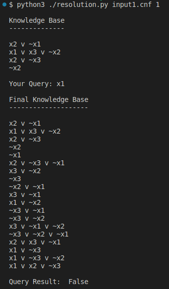
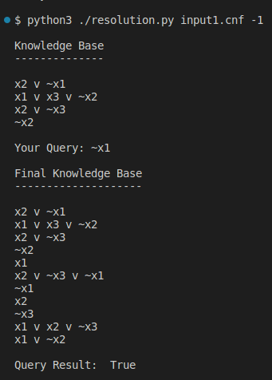
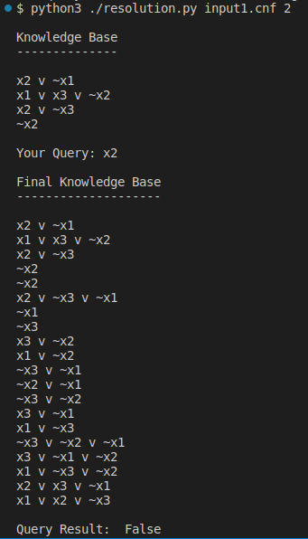
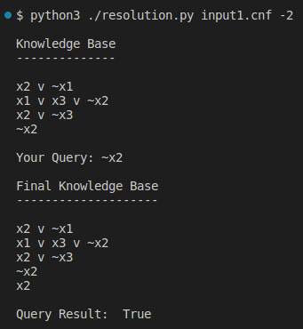

# Lab 7: Implementation of Resolution

By _Kiran Srinivasan_ (106120051)  

## Code

```python
import sys

def get_input(filename):
    # Input follows the DIMACS format: https://www.cs.utexas.edu/users/moore/acl2/manuals/current/manual/index-seo.php/SATLINK____DIMACS
    f = open(filename, 'r')
    clauses = []
    for line in f:
        if line[0] in ['c','0','%']:
            continue
        elif line[0] == 'p':
            words = line.split()
            num_clauses = int(words[-1])
            num_variables = int(words[-2])
        else:
            clause = [int(n) for n in line.split()]
            if clause[-1] != 0:
                print('Error: Terminal number of one or more clauses is not 0!')
                return None
            clause = clause[:-1]
            if any(abs(n) > num_variables or abs(n) < 1 for n in clause):
                print('Error: Total number of variables exceeds limit!')
                return None
            clauses.append(set(clause))
    f.close()
    if len(clauses) != num_clauses:
        print('Error: Total number of clauses not equal to specification!')
        return None
    return clauses

def pl_resolution(clauses, query):
    
    if clauses == None:
        return None
    
    clauses.append({-query})
    new_clauses = []
    
    while True:

        # iterate through every pair of clauses
        for i in range(len(clauses)):
            for j in range(i+1, len(clauses)):
                
                resolvent = pl_resolve(clauses, i, j)
                
                # if no resolution obtained, skip current pair of clauses
                if resolvent == None:
                    continue
                
                # if resolution is empty (i.e.: False) return True
                if set() == resolvent:
                    return True

                # add resolvent to new_clauses
                if resolvent not in new_clauses:
                    new_clauses.append(resolvent)

        # if new_clauses is a subset of clauses, return False
        if all(clause in clauses for clause in new_clauses):
            return False

        # clauses = clauses U new_clauses 
        clauses += [clause for clause in new_clauses if clause not in clauses]
        
def pl_resolve(clauses, i, j):
    # factoring
    resolvent = clauses[i].union(clauses[j])

    # unit resolution
    complementary_vars = [literal for literal in resolvent if literal > 0 and -literal in resolvent]
    
    # if no complementary variables, return disjunction of both clauses
    if len(complementary_vars) == 0:
        return resolvent
    
    # if exactly one complementary variable, remove the corresponding literals and return
    elif len(complementary_vars) == 1:
        var = complementary_vars[0]
        resolvent.remove(var)
        resolvent.remove(-var)
        return resolvent

    # if more than one complementary variable, return None

def human_readable_kb(clauses):
    print()
    for clause in clauses:
        for idx, literal in enumerate(clause):
            if literal > 0:
                print(f'x{literal}', end=' ')
            else:
                print(f'~x{-literal}', end=' ')
            if idx != len(clause)-1:
                print(f'v', end=' ')
            else:
                print()

if len(sys.argv) != 3:
    print('Usage: ./resolution.py [INPUT_FILE] [QUERY]\n\nInput file must be a cnf file in DIMACS format\nThe query must be in the form of a single non-zero integer')
else:
    filename = sys.argv[1]
    query = int(sys.argv[2])
    clauses = get_input(filename)

    print('\nKnowledge Base')
    print('--------------')
    human_readable_kb(clauses)
    print('\nYour Query: ', end='')
    if query > 0:
        print(f'x{query}')
    else:
        print(f'~x{-query}')
    result = pl_resolution(clauses, query)
    print('\nFinal Knowledge Base')
    print('--------------------')
    human_readable_kb(clauses)
    print('\nQuery Result: ', result, end='\n\n')

```

## Outputs

### Input File

```
c This is a comment
c This file is in DIMACS cnf format
c Each variable is indicated by a natural number
c Negative literals are prefixed with a minus symbol
c Positive literals are not prefixed with any symbol
c The 2 numbers below indicate number of variables and number of clauses respectively
p 3 4
c the clauses are listed below
c each clause is terminated with a 0
-1 2 0
-2 3 1 0
-3 2 0
-2 0
```

### Output 0

```console
$ python3 ./resolution.py
Usage: ./resolution.py [INPUT_FILE] [QUERY]

Input file must be a cnf file in DIMACS format
The query must be in the form of a single non-zero integer
```

### Output 1

```console
$ python3 ./resolution.py input1.cnf 1

Knowledge Base
--------------

x2 v ~x1 
x1 v x3 v ~x2 
x2 v ~x3 
~x2 

Your Query: x1

Final Knowledge Base
--------------------

x2 v ~x1 
x1 v x3 v ~x2 
x2 v ~x3 
~x2 
~x1 
x2 v ~x3 v ~x1 
x3 v ~x2 
~x3 
~x2 v ~x1 
x3 v ~x1 
x1 v ~x2 
~x3 v ~x1 
~x3 v ~x2 
x3 v ~x1 v ~x2 
~x3 v ~x2 v ~x1 
x2 v x3 v ~x1 
x1 v ~x3 
x1 v ~x3 v ~x2 
x1 v x2 v ~x3 

Query Result:  False
```



### Output 2

```console
$ python3 ./resolution.py input1.cnf -1

Knowledge Base
--------------

x2 v ~x1 
x1 v x3 v ~x2 
x2 v ~x3 
~x2 

Your Query: ~x1

Final Knowledge Base
--------------------

x2 v ~x1 
x1 v x3 v ~x2 
x2 v ~x3 
~x2 
x1 
x2 v ~x3 v ~x1 
~x1 
x2 
~x3 
x1 v x2 v ~x3 
x1 v ~x2 

Query Result:  True
```



### Output 3

```console
$ python3 ./resolution.py input1.cnf 2

Knowledge Base
--------------

x2 v ~x1 
x1 v x3 v ~x2 
x2 v ~x3 
~x2 

Your Query: x2

Final Knowledge Base
--------------------

x2 v ~x1 
x1 v x3 v ~x2 
x2 v ~x3 
~x2 
~x2 
x2 v ~x3 v ~x1 
~x1 
~x3 
x3 v ~x2 
x1 v ~x2 
~x3 v ~x1 
~x2 v ~x1 
~x3 v ~x2 
x3 v ~x1 
x1 v ~x3 
~x3 v ~x2 v ~x1 
x3 v ~x1 v ~x2 
x1 v ~x3 v ~x2 
x2 v x3 v ~x1 
x1 v x2 v ~x3 

Query Result:  False
```




### Output 4

```console
$ python3 ./resolution.py input1.cnf -2

Knowledge Base
--------------

x2 v ~x1 
x1 v x3 v ~x2 
x2 v ~x3 
~x2 

Your Query: ~x2

Final Knowledge Base
--------------------

x2 v ~x1 
x1 v x3 v ~x2 
x2 v ~x3 
~x2 
x2 

Query Result:  True
```

